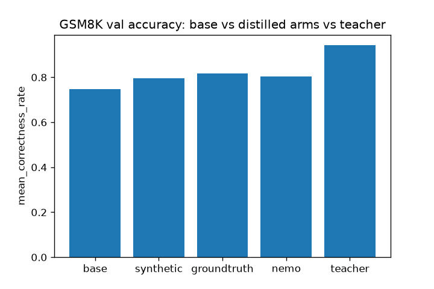
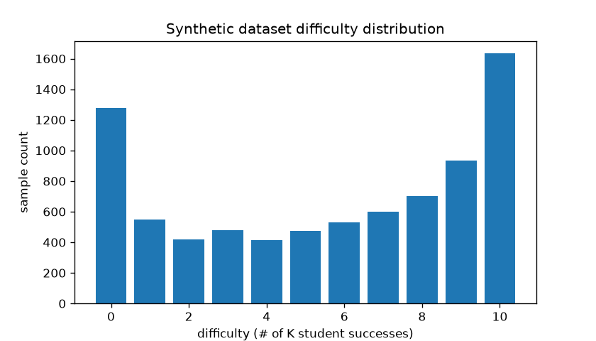
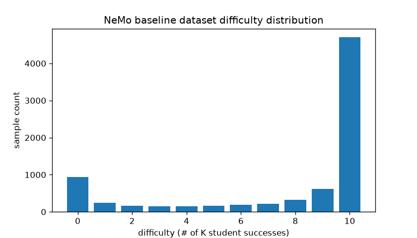
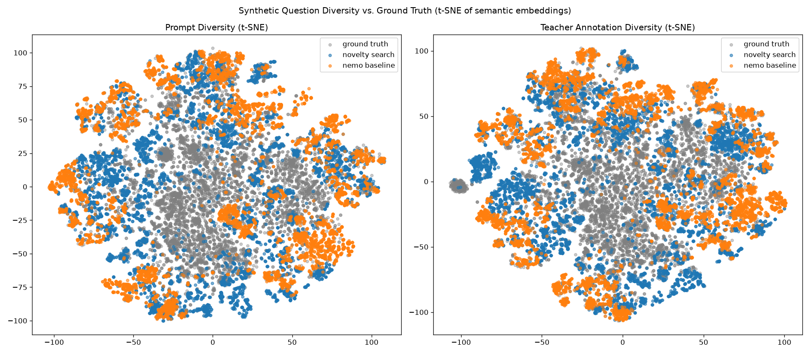

# Novelty-Search-Driven Data Augmentation for GSM8K Distillation

**Abstract.** We ask whether synthetic training data generated by a novelty-search
evolutionary loop is more diverse — and closes more of the teacher/student distillation
gap — than either plain ground-truth GSM8K questions or a flat (non-evolutionary)
synthetic baseline (NeMo DataDesigner). We evolve GSM8K-style word problems with a
Qwen3-32B teacher, using a combined semantic/reasoning/difficulty novelty signal, and
distill a Qwen3-1.7B student on each of three size-matched arms: novelty-search
synthetic, real ground truth, and a NeMo Data Designer flat-synthetic baseline. The
clearest result is on diversity: scored with the Vendi score (an effective count of
distinct samples), novelty search's question and reasoning embeddings are ~2.4–2.7x more
diverse than the flat baseline's, and still cover the ground-truth distribution more
closely (lower mean nearest-neighbor distance) on both axes. Accuracy shows the same
ordering: ground truth closes the most gap (34.8%), followed by the NeMo baseline
(28.5%) and novelty search (23.8%). Under a rank-32 LoRA over attention+MLP trained for
3 epochs, all three arms now close a substantial share of the teacher/student gap,
rather than the marginal movement seen with a 1-epoch, rank-16 run.

## 1. Research questions

- Can we improve SFT distillation efficiency by optimizing the *distribution* of the
  training data?
- Does an evolutionary/novelty-search process for synthetic question generation produce
  more uniform difficulty coverage (easy → hard) than an unconstrained generator?
- Does that improved coverage and diversity translate into better downstream distillation
  (student accuracy after SFT)?

## 2. Method

### 2.1 Data generation (novelty search arm)

Starting from 5 seed GSM8K questions, `scripts/run_novelty_search_augmentatin.py` drives
[`novelty_search_evolution`](../../README.md)'s evolutionary loop with two LLM-backed
operators (both implemented against a Qwen3-32B teacher via Bedrock, see
`novelty_search/prompts.py`):

- **Mutation** (`make_mut_fn`) — paraphrases a single parent question into a topic-
  conditioned variant (topic drawn from `TOPICS`, e.g. "shopping and money", "travel and
  distance"), changing entities/numbers and optionally adding/removing a reasoning step.
- **Crossover** (`make_crossover_fn`) — takes *two* parent questions, has the teacher
  identify each one's underlying arithmetic technique (e.g. multi-step subtraction, rate
  × time, unit conversion), and writes one new question that combines elements of both
  techniques, again conditioned on a topic.

Each candidate question is solved by the teacher (its completion is treated as ground
truth) and scored for difficulty by sampling the Qwen3-1.7B student K=10 times and
counting how many samples match the teacher's answer — difficulty is thus an integer in
`[0, 10]`. Candidates with a malformed/missing `#### <answer>` line are filtered out
(`format_filter_fn`).

Novelty is scored in an embedding space that gives equal weight to *what* is asked and
*how* it's solved (`novelty_search/embedding.py::combine_embeddings`) and the difficulty distribution:

```
embedding = unit_norm(question_semantic) ⊕ unit_norm(teacher_completion_semantic) ⊕ one_hot(difficulty)
```

using Bedrock Titan text embeddings for the semantic blocks. The evolutionary loop
(k-NN novelty selection, `nn-k=50`, cosine distance) runs until it has kept `num_samples`
accepted candidates in total (`--num-samples`, default 8000) — difficulty is still one
axis of the novelty embedding, but coverage across buckets 0–10 is no longer a hard
per-bucket minimum. The final synthetic dataset
(`output/synthetic_distillation.parquet`, n=8011) breaks down as:

| source | count |
|---|---|
| mutation | 5403 |
| crossover | 2603 |
| seed | 5 |

i.e. crossover — a technique-blending operator novelty search alone enables — contributed
about a third of the final dataset.

### 2.2 Baselines

- **Ground truth** — real GSM8K training questions, annotated with the same teacher
  completions (`scripts/annotate_groundtruth.py`), size-matched to the synthetic arm.
- **NeMo baseline** — NVIDIA NeMo Data Designer generating GSM8K-style questions directly
  from topic/difficulty/num-steps samplers with no evolutionary search or novelty
  selection (`baseline_nemo.py`), size-matched to the synthetic arm.

### 2.3 Training

Each arm is distilled independently via LoRA SFT (`train.py`) with identical
hyperparameters (`configs/`):

- Base model: `Qwen/Qwen3-1.7B`
- LoRA: rank 32, alpha 64, target modules
  `q_proj/k_proj/v_proj/o_proj/gate_proj/up_proj/down_proj`
- Learning rate 2e-4, bfloat16, 3 epochs, cosine LR schedule, 3% warmup

### 2.4 Evaluation

`eval.py` evaluates the base student, the teacher, and each LoRA-distilled student on the
full GSM8K validation split (1319 questions, k=1 sample/question), parsing the final
`#### <number>` line and reporting `mean_correctness_rate`. `report.py` then computes,
for each distilled arm:

```
gap_closure = (distilled_accuracy − base_accuracy) / (teacher_accuracy − base_accuracy)
```

## 3. Results

### 3.1 Distillation accuracy and gap closure



| arm | accuracy | gap closure |
|---|---:|---:|
| base | 0.7483 | – |
| synthetic | 0.7945 | 23.8% |
| groundtruth | 0.8158 | 34.8% |
| nemo | 0.8036 | 28.5% |
| teacher | 0.9424 | – |

With a rank-32 LoRA over attention+MLP trained for 3 epochs, all three arms now close a
substantial share of the teacher/student gap above the untrained base (0.7483). Ground
truth leads (0.8158, 34.8% gap closure), followed by the NeMo baseline (0.8036, 28.5%)
and novelty-search synthetic (0.7945, 23.8%) — the same ordering as the earlier
1-epoch/rank-16 run, but with far larger and now clearly separated gap-closure shares
rather than a near-tie. This is still a single k=1 eval run per arm, so we'd want repeat
runs before treating the exact ranking as settled, but the gap between arms is no longer
small enough to dismiss — §3.3's diversity metrics remain the more decisive comparison
between the two synthetic arms specifically.

### 3.2 Difficulty coverage

<p float="left">
  
  
</p>

*(left: novelty search — difficulty is one axis of the novelty embedding; right: NeMo
baseline — unconstrained sampling)*

Neither distribution is uniform at this scale — both skew toward the easiest bucket
(difficulty 10, all K student samples correct) — but novelty search's is markedly
flatter: its middle buckets (2–6) hold 420–530 samples each versus NeMo's 150–200, and
its easiest bucket is 1.6k samples versus NeMo's 4.7k. Difficulty being one axis of the
novelty embedding still meaningfully counteracts the generator's tendency to collapse
onto easy questions, even without a hard per-bucket minimum.

### 3.3 Diversity: prompt vs. teacher annotation



Each dataset is embedded twice — once on question text ("prompt") and once on the
teacher's solution/reasoning ("teacher_annotation") — using the same Titan embeddings
novelty search itself uses for selection, with cosine distance. All three datasets are
capped to n=7473 (the size of the smallest, ground truth) before scoring, for a fair
size-matched comparison (`scripts/diversity_report.py`):

| dataset | n | prompt avg pairwise dist | prompt Vendi score | prompt coverage dist to GT | annotation avg pairwise dist | annotation Vendi score | annotation coverage dist to GT |
|---|---:|---:|---:|---:|---:|---:|---:|
| groundtruth | 7473 | 0.9139 | 300.2 | – | 0.9016 | 269.6 | – |
| novelty_search | 7473 | 0.9129 | 193.9 | 0.6707 | 0.8905 | 184.1 | 0.6338 |
| nemo_baseline | 7473 | 0.8627 | 73.0 | 0.6903 | 0.8564 | 79.1 | 0.6547 |

Higher average pairwise distance means a dataset is more internally diverse; the Vendi
score (`novelty_search_evolution.vendi_score`) turns the full pairwise-similarity
spectrum into an effective count of distinct samples, so it's a stricter, more
holistic diversity measure than a single average-distance number; lower coverage
distance to ground truth (mean cosine distance from each ground-truth embedding to its
nearest synthetic neighbor) means the synthetic set covers more of the real
distribution.

The Vendi score shows the sharpest separation of any metric here: novelty search scores
193.9 vs. NeMo's 73.0 on the question axis and 184.1 vs. 79.1 on the reasoning axis —
roughly **2.4–2.7x** more effective distinct samples out of the same 7473-sample pool.
Novelty search also covers ground truth more closely on both the question axis (0.6707
vs. 0.6903) and the reasoning axis (0.6338 vs. 0.6547). This is a much starker gap than
the raw accuracy numbers in §3.1 show — the two synthetic arms land close together on
downstream accuracy this run, but novelty search is decisively more diverse.

## 4. Discussion

The clearest, most reproducible result in this run is on diversity, not accuracy.
Novelty search's explicit optimization over a combined question+reasoning+difficulty
embedding gives both its question distribution and its reasoning-style distribution
substantially better coverage of real GSM8K than an unconstrained generator achieves —
a ~2.4–2.7x Vendi-score advantage over the NeMo baseline on both axes, plus closer
coverage of the ground-truth distribution. The difficulty-distribution comparison in
§3.2 tells the same story at a coarser grain: novelty search's difficulty-aware
embedding keeps its samples much more evenly spread across easy and hard buckets than
NeMo's unconstrained sampling, which collapses heavily onto the easiest bucket.

Accuracy is more differentiated under the updated training recipe. Ground truth still
leads on gap closure (34.8%), with the NeMo baseline (28.5%) and novelty search (23.8%)
both closing large but smaller shares, in the same order as the earlier 1-epoch/rank-16
run. The gap between the two synthetic arms is now wide enough to be worth noting rather
than dismissing as noise, though it's still a single k=1 eval run per arm — a case of
large, robust diversity gains only partly translating into a correspondingly large
downstream accuracy gap at this scale. The crossover operator —
blending two parents' arithmetic techniques rather than paraphrasing a single parent —
again contributed roughly a third of the final synthetic dataset (2603/8011), suggesting
technique-blending remains a meaningful source of the novelty search arm's diversity
advantage even as the dataset scaled up ~8x from the previous run.

## 5. Replicating this experiment

### Prerequisites

- Python env per the repo root `CLAUDE.md` (`uv venv --python 3.12 --seed --managed-python`,
  `pip install -e .`), plus this example's extra dependencies:
  `pip install -r examples/gsm8k_distillation/requirements.txt`
- AWS Bedrock credentials (standard boto3 credential chain) — used for the Qwen3-32B
  teacher and Titan embeddings.
- A CUDA GPU — used for the colocated vLLM student (data generation, training, and
  evaluation).

### One-command full pipeline

```bash
PYTHONPATH=. bash examples/gsm8k_distillation/run_full_experiment.sh
```

`run_full_experiment.sh` is the single entry point for the whole experiment — it downloads
GSM8K, generates all three arms' data (novelty-search synthetic, ground-truth annotation,
NeMo baseline), builds the diversity report, runs SFT, and evaluates everything, in the order
described in §2. Add `--smoke-test` for a fast end-to-end wiring check (tiny sample counts
throughout), `--regenerate-data` to force-regenerate datasets even if they already exist,
`--wandb` to log training runs to the `gsm8k-distillation` W&B project, `--model-id=<hf-model-id>`
to pick the student (default `Qwen/Qwen3-1.7B`, the model used for the results above), and
`--num-samples=<n>` to set the novelty-search dataset's total kept-sample target (default 8000,
§2.1).

Checkpoints, per-arm eval reports, and the gap-closure report are namespaced under a slug
derived from `--model-id` (`/` → `_`, e.g. `Qwen_Qwen3-1.7B`) so results from different
student models don't collide; the generated datasets and the teacher eval report are shared
across model choices and are not namespaced. Under the hood the script downloads data,
generates the ground-truth and NeMo-baseline datasets, runs the diversity report, then runs
the core novelty-search/train/eval loop — all inline in `run_full_experiment.sh` itself, with
no separate stage scripts:

1. Generates synthetic data (`scripts/run_novelty_search_augmentatin.py`, if not already
   present) and evaluates the base student + teacher on GSM8K val (`scripts/eval.py`, if their
   reports don't already exist) → `output/eval/<model_slug>/base/report.json`,
   `output/eval/teacher/report.json`.
2. Trains the synthetic, ground-truth, and NeMo-baseline arms (`scripts/train.py`, LoRA SFT,
   size-matched, skipped per-arm if its checkpoint dir already exists) →
   `checkpoints/<model_slug>/{synthetic,groundtruth,nemo_baseline}/`.
3. Evaluates all three trained arms (`scripts/eval.py`, skipped per-arm if its report already
   exists) and builds the gap-closure report (`scripts/report.py`) →
   `output/gap_closure/<model_slug>/gap_closure_report.{json,png}`.

Every step is individually skipped if its output already exists, so re-running
`run_full_experiment.sh` picks up wherever a previous (partial or interrupted) run left off;
pass `--regenerate-data` to force everything to regenerate regardless.

The NeMo baseline dataset (`output/baseline_nemo_distillation.parquet`) and the
ground-truth annotations (`data/gsm8k_train_teacher_annotated.parquet`) are prerequisites
of the training step; `run_full_experiment.sh` generates them automatically, or generate them
manually beforehand with `scripts/baseline_nemo.py` and `scripts/annotate_groundtruth.py`
respectively if calling `scripts/train.py` directly.

### Diversity report

```bash
PYTHONPATH=. python examples/gsm8k_distillation/scripts/diversity_report.py
```

Requires `output/synthetic_distillation.parquet`, `output/baseline_nemo_distillation.parquet`,
and `data/gsm8k_train_teacher_annotated.parquet` to already exist. Writes
`output/diversity_metrics.json` and `output/diversity_tsne.png`. Embeddings are cached
under `output/embedding_cache/`, so repeat runs skip Bedrock calls when the underlying
question/completion sets are unchanged.

## 6. Repo map

| file | role |
|---|---|
| `run_full_experiment.sh` | Single entry point: download → generate all arms → diversity report → SFT → evals |
| `scripts/download_data.py` | Downloads the GSM8K train/val splits |
| `scripts/run_novelty_search_augmentatin.py` | Novelty search data generation (mutation + crossover operators) |
| `scripts/baseline_nemo.py` | Flat synthetic baseline via NeMo Data Designer |
| `scripts/annotate_groundtruth.py` | Annotates real GSM8K questions with teacher completions |
| `scripts/train.py` | LoRA SFT training, shared across all arms |
| `scripts/eval.py` | GSM8K val evaluation (student or teacher) |
| `scripts/report.py` | Gap-closure report/plot across all arms |
| `scripts/diversity_report.py` | Prompt/teacher-annotation diversity metrics (avg pairwise distance, Vendi score, coverage distance to ground truth) + t-SNE plot |
| `novelty_search/embedding.py` | Question+completion+difficulty embedding used for novelty selection |
| `novelty_search/prompts.py` | Teacher prompt templates (mutation, crossover, solve) and answer parsing |
