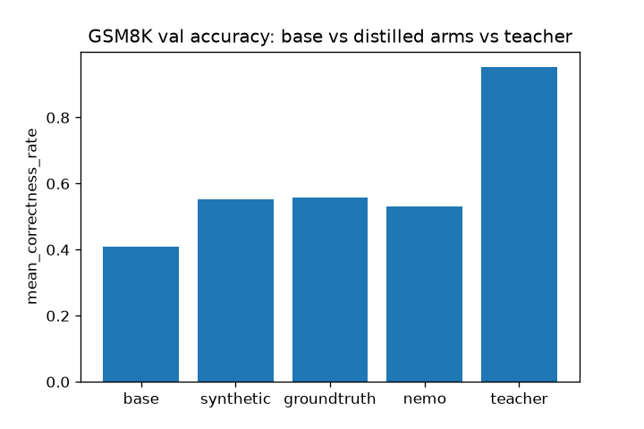
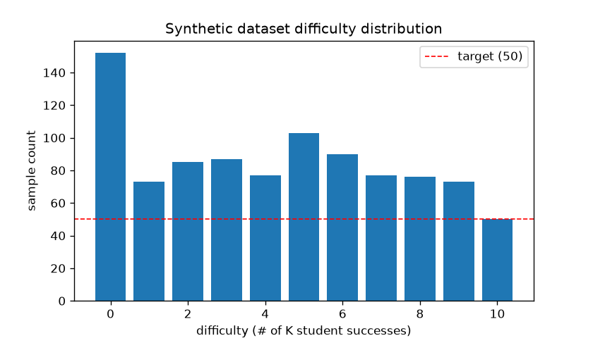
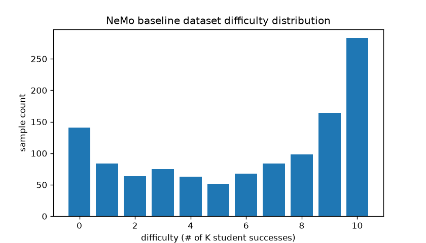
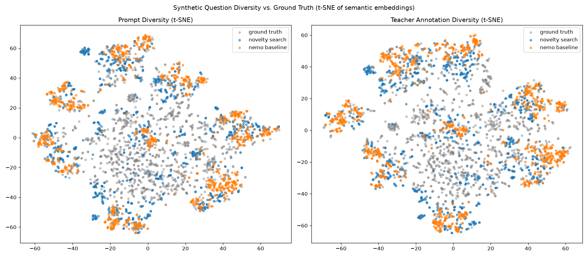

# Novelty-Search-Driven Data Augmentation for GSM8K Distillation

**Abstract.** We ask whether synthetic training data generated by a novelty-search
evolutionary loop closes more of the teacher/student distillation gap than either plain
ground-truth GSM8K questions or a flat (non-evolutionary) synthetic baseline. We evolve
GSM8K-style word problems with a Qwen3-32B teacher, using a combined
semantic/reasoning/difficulty novelty signal, and distill a Qwen3-0.6B student on each of
three size-matched arms: novelty-search synthetic, real ground truth, and a NeMo Data
Designer flat-synthetic baseline. Ground truth still closes the most gap (27.1%), but
novelty search (26.5%) is close behind and closes noticeably more of the gap than the
flat synthetic baseline (22.2%) — despite being fully synthetic — and its diversity
metrics track this ordering: novelty search's question and reasoning embeddings cover
the ground-truth distribution more closely (lower mean nearest-neighbor distance) than
the flat baseline's on both axes.

## 1. Research questions

Following the experiment design in `SPEC.md`:

- Can we improve SFT distillation efficiency by optimizing the *distribution* of the
  training data, rather than just its quantity?
- Does an evolutionary/novelty-search process for synthetic question generation produce
  more uniform difficulty coverage (easy → hard) than an unconstrained generator?
- Does that improved coverage and diversity translate into better downstream distillation
  (student accuracy after SFT)?

## 2. Method

### 2.1 Data generation (novelty search arm)

Starting from 5 seed GSM8K questions, `run.py` drives
[`novelty_search_evolution`](../../README.md)'s evolutionary loop with two LLM-backed
operators (both implemented against a Qwen3-32B teacher via Bedrock, see
`novelty_search/prompts.py`):

- **Mutation** (`make_mut_fn`) — paraphrases a single parent question into a topic-
  conditioned variant (topic drawn from `TOPICS`, e.g. "shopping and money", "travel and
  distance"), changing entities/numbers and optionally adding/removing a reasoning step.
- **Crossover** (`make_crossover_fn`) — takes *two* parent questions, has the teacher
  identify each one's underlying arithmetic technique (e.g. multi-step subtraction, rate
  × time, unit conversion), and writes one new question that combines elements of both
  techniques, again conditioned on a topic.

Each candidate question is solved by the teacher (its completion is treated as ground
truth) and scored for difficulty by sampling the Qwen3-0.6B student K=10 times and
counting how many samples match the teacher's answer — difficulty is thus an integer in
`[0, 10]`. Candidates with a malformed/missing `#### <answer>` line are filtered out
(`format_filter_fn`).

Novelty is scored in an embedding space that gives equal weight to *what* is asked and
*how* it's solved (`novelty_search/embedding.py::combine_embeddings`):

```
embedding = unit_norm(question_semantic) ⊕ unit_norm(teacher_completion_semantic) ⊕ one_hot(difficulty)
```

using Bedrock Titan text embeddings for the semantic blocks. The evolutionary loop
(k-NN novelty selection, `nn-k=50`, cosine distance) runs until every difficulty bucket
0–10 has at least 50 accepted samples. The final synthetic dataset
(`output/synthetic_distillation.parquet`, n=943) breaks down as:

| source | count |
|---|---|
| mutation | 620 |
| crossover | 318 |
| seed | 5 |

i.e. crossover — a technique-blending operator novelty search alone enables — contributed
about a third of the final dataset.

### 2.2 Baselines

- **Ground truth** — real GSM8K training questions, annotated with the same teacher
  completions (`scripts/annotate_groundtruth.py`), size-matched to the synthetic arm.
- **NeMo baseline** — NVIDIA NeMo Data Designer generating GSM8K-style questions directly
  from topic/difficulty/num-steps samplers with no evolutionary search or novelty
  selection (`baseline_nemo.py`), size-matched to the synthetic arm.

### 2.3 Training

Each arm is distilled independently via LoRA SFT (`train.py`) with identical
hyperparameters (`configs/`):

- Base model: `Qwen/Qwen3-0.6B`
- LoRA: rank 16, alpha 32, target modules `q_proj/k_proj/v_proj/o_proj`
- Learning rate 1e-5, bfloat16, 2 epochs

### 2.4 Evaluation

`eval.py` evaluates the base student, the teacher, and each LoRA-distilled student on the
full GSM8K validation split (1319 questions, k=1 sample/question), parsing the final
`#### <number>` line and reporting `mean_correctness_rate`. `report.py` then computes,
for each distilled arm:

```
gap_closure = (distilled_accuracy − base_accuracy) / (teacher_accuracy − base_accuracy)
```

## 3. Results

### 3.1 Distillation accuracy and gap closure



| arm | accuracy | gap closure |
|---|---:|---:|
| base | 0.409 | – |
| synthetic | 0.553 | 26.5% |
| groundtruth | 0.556 | 27.1% |
| nemo | 0.530 | 22.2% |
| teacher | 0.952 | – |

Novelty-search synthetic data closes most of the accuracy gap between the untrained
0.6B student and its 32B teacher — 26.5%, versus 27.1% for real ground-truth data of the
same size, and 22.2% for the flat NeMo baseline. In other words, purely synthetic,
evolutionarily-generated data recovers nearly all of the benefit of real training data on
this task, and clearly outperforms an unconstrained synthetic generator of the same size.

### 3.2 Difficulty coverage

<p float="left">
  
  
</p>

*(left: novelty search — target-uniform by construction, min 50 samples/bucket; right:
NeMo baseline — unconstrained sampling)*

Novelty search's stopping condition (every difficulty bucket ≥ 50 samples) directly
targets uniform difficulty coverage, giving the student consistent signal across easy and
hard questions rather than an arbitrary difficulty distribution.

### 3.3 Diversity: prompt vs. teacher annotation



Each dataset is embedded twice — once on question text ("prompt") and once on the
teacher's solution/reasoning ("teacher_annotation") — using the same Titan embeddings
novelty search itself uses for selection, with cosine distance:

| dataset | n | prompt avg pairwise dist | prompt coverage dist to GT | annotation avg pairwise dist | annotation coverage dist to GT |
|---|---:|---:|---:|---:|---:|
| groundtruth | 1200 | 0.9133 | – | 0.9002 | – |
| novelty_search | 943 | 0.9021 | 0.6568 | 0.8801 | 0.6177 |
| nemo_baseline | 1176 | 0.8629 | 0.6920 | 0.8565 | 0.6568 |

Higher average pairwise distance means a dataset is more internally diverse; lower
coverage distance to ground truth (mean cosine distance from each ground-truth embedding
to its nearest synthetic neighbor) means the synthetic set covers more of the real
distribution. Novelty search is more internally diverse than the NeMo baseline on both
components, and covers ground truth more closely on both the question axis (0.6568
vs. 0.6920) and the reasoning axis (0.6177 vs. 0.6568) — consistent with its higher
downstream accuracy.

## 4. Discussion

Ground truth still wins on raw accuracy — real questions carry real distributional
signal that even a well-designed synthetic generator only approximates. But the gap
between novelty search and ground truth is small (26.5% vs. 27.1% gap closure), while
the gap between novelty search and the flat synthetic baseline is much larger (26.5% vs.
22.2%) despite both being fully synthetic and size-matched. The diversity metrics offer a
plausible mechanism: novelty search's explicit optimization over a combined
question+reasoning+difficulty embedding gives both its question distribution and its
reasoning-style distribution better coverage of real GSM8K than an unconstrained
generator achieves, and its difficulty-bucket stopping condition guarantees coverage across
difficulty levels that a flat sampler doesn't. The crossover operator — new to this
run, blending two parents' arithmetic techniques rather than paraphrasing a single
parent — contributed roughly a third of the final dataset, suggesting technique-blending
is a meaningful source of the novelty search arm's diversity.

## 5. Replicating this experiment

### Prerequisites

- Python env per the repo root `CLAUDE.md` (`uv venv --python 3.12 --seed --managed-python`,
  `pip install -e .`), plus this example's extra dependencies:
  `pip install -r examples/gsm8k_distillation/requirements.txt`
- AWS Bedrock credentials (standard boto3 credential chain) — used for the Qwen3-32B
  teacher and Titan embeddings.
- A CUDA GPU — used for the colocated Qwen3-0.6B vLLM student (data generation, training,
  and evaluation).

### One-command full pipeline

```bash
PYTHONPATH=. bash examples/gsm8k_distillation/scripts/run_experiments.sh
```

Add `--smoke-test` for a fast end-to-end wiring check (tiny sample counts throughout),
`--regenerate-data` to force-regenerate the synthetic dataset even if
`output/synthetic_distillation.parquet` already exists, and `--wandb` to log training runs
to the `gsm8k-distillation` W&B project.

This wraps three stages, each independently rerunnable:

1. `bash examples/gsm8k_distillation/scripts/eval_base.sh` — generates synthetic data
   (`run.py`, if not already present) and evaluates the base student + teacher on GSM8K
   val → `output/eval/{base,teacher}/report.json`.
2. `bash examples/gsm8k_distillation/scripts/train.sh` — trains the synthetic,
   ground-truth, and NeMo-baseline arms (LoRA SFT, size-matched) →
   `checkpoints/{synthetic,groundtruth,nemo_baseline}/`.
3. `bash examples/gsm8k_distillation/scripts/eval_trained.sh` — evaluates all three
   trained arms and builds the gap-closure report →
   `output/gap_closure_report.{json,png}`.

The NeMo baseline dataset (`output/baseline_nemo_distillation.parquet`) and the
ground-truth annotations (`data/gsm8k_train_teacher_annotated.parquet`) are prerequisites
of `train.sh`; generate them beforehand with `baseline_nemo.py` and
`scripts/annotate_groundtruth.py` respectively if they don't already exist.

### Diversity report

```bash
PYTHONPATH=. python examples/gsm8k_distillation/diversity_report.py
```

Requires `output/synthetic_distillation.parquet`, `output/baseline_nemo_distillation.parquet`,
and `data/gsm8k_train_teacher_annotated.parquet` to already exist. Writes
`output/diversity_metrics.json` and `output/diversity_tsne.png`. Embeddings are cached
under `output/embedding_cache/`, so repeat runs skip Bedrock calls when the underlying
question/completion sets are unchanged.

## 6. Repo map

| file | role |
|---|---|
| `run.py` | Novelty search data generation (mutation + crossover operators) |
| `baseline_nemo.py` | Flat synthetic baseline via NeMo Data Designer |
| `scripts/annotate_groundtruth.py` | Annotates real GSM8K questions with teacher completions |
| `train.py` | LoRA SFT training, shared across all arms |
| `eval.py` | GSM8K val evaluation (student or teacher) |
| `report.py` | Gap-closure report/plot across all arms |
| `diversity_report.py` | Prompt/teacher-annotation diversity metrics + t-SNE plot |
| `novelty_search/embedding.py` | Question+completion+difficulty embedding used for novelty selection |
| `novelty_search/prompts.py` | Teacher prompt templates (mutation, crossover, solve) and answer parsing |
| `scripts/run_experiments.sh` | Orchestrates the full pipeline end to end |
